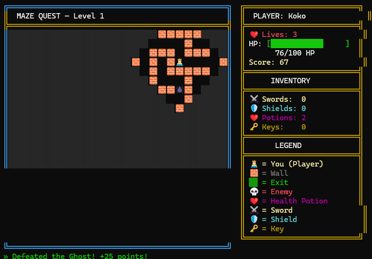

# Maze Quest

**A Console-Based Data Structure and Algorithm (DSA) Demonstration Game**

This document explains every Data Structure and Algorithm (DSA) used in the game, including their purpose and the actual C# code from the system.

---

## 1. 2D Arrays (Grid Representation)
**Purpose:** The maze itself is stored as a 2-Dimensional integer array where each number represents a `CellType` (Wall, Path, Player, Enemy, Items, Exit).
**Code Implementation (GameState.cs):**
```csharp
public int[,] Maze { get; set; } = new int[0, 0];

public int MazeRows => Maze.GetLength(0);
public int MazeCols => Maze.GetLength(1);
```

---

## 2. Stack (LIFO - Last-In, First-Out)
**Purpose:** Used to implement the **Undo System**. Every time the player takes a step, their previous position is pushed onto the Stack. When the player presses 'U', the program pops the last position, allowing them to reverse their movements step-by-step.
**Code Implementation (GameState.cs):**
```csharp
// Definition:
public Stack<(int row, int col)> MoveHistory { get; set; } = new();

// Usage (Player.cs - UndoMove):
if (state.MoveHistory.Count > 0)
{
    var (prevRow, prevCol) = state.MoveHistory.Pop();
    // Revert state...
}
```

---

## 3. Queue (FIFO - First-In, First-Out)
**Purpose:** Used for the **BFS pathfinding frontier** and the **Enemy Action Queue**.
**Code Implementation (GameState.cs & Algorithms.cs):**
```csharp
// GameState.cs:
public Queue<Enemy> EnemyActionQueue { get; set; } = new();

// Algorithms.cs (BFS):
var queue = new Queue<(int row, int col)>();
queue.Enqueue(start);
// ...
var current = queue.Dequeue();
```

---

## 4. Dictionary / Hash Map
**Purpose:** Used for fast **Inventory Management** and **Path Reconstruction** in BFS. The dictionary maps an item's name (key) to the quantity (value) or positions to parent nodes.
**Code Implementation (GameState.cs & Algorithms.cs):**
```csharp
// GameState.cs (Inventory):
public Dictionary<string, int> Inventory { get; set; } = new()
{
    { "Sword", 0 },
    { "Shield", 0 },
    { "HealthPotion", 1 },
    { "Key", 0 }
};

// Algorithms.cs (BFS parent tracking):
var parent = new Dictionary<(int, int), (int, int)?>();
parent[start] = null;
```

---

## 5. Breadth-First Search (BFS)
**Purpose:** Used for **Enemy AI and Pathfinding**. The enemy uses BFS to find the absolute shortest optimal path toward the player's current coordinate through the complex maze walls.
**Actual Code (Algorithms.cs):**
```csharp
public static List<(int row, int col)> BFS(int[,] maze, (int row, int col) start, (int row, int col) goal)
{
    int rows = maze.GetLength(0);
    int cols = maze.GetLength(1);
    bool[,] visited = new bool[rows, cols];
    var parent = new Dictionary<(int, int), (int, int)?>();
    var queue = new Queue<(int row, int col)>();

    queue.Enqueue(start);
    visited[start.row, start.col] = true;
    parent[start] = null;

    int[] dr = { -1, 1, 0, 0 };
    int[] dc = { 0, 0, -1, 1 };

    while (queue.Count > 0)
    {
        var current = queue.Dequeue();
        if (current == goal)
        {
            var path = new List<(int, int)>();
            (int, int)? node = goal;
            while (node != null)
            {
                path.Add(node.Value);
                node = parent[node.Value];
            }
            path.Reverse();
            return path;
        }

        for (int i = 0; i < 4; i++)
        {
            int nr = current.row + dr[i];
            int nc = current.col + dc[i];

            if (nr >= 0 && nr < rows && nc >= 0 && nc < cols &&
                !visited[nr, nc] && maze[nr, nc] != (int)CellType.Wall)
            {
                visited[nr, nc] = true;
                parent[(nr, nc)] = current;
                queue.Enqueue((nr, nc));
            }
        }
    }
    return new List<(int, int)>();
}
```

---

## 6. Linear Search
**Purpose:** Used to linearly scan through the 2D array or lists to find valid empty spots to spawn items, traps, and enemies.
**Actual Code (Algorithms.cs):**
```csharp
public static (int row, int col) LinearSearch(int[,] maze, int targetType)
{
    int rows = maze.GetLength(0);
    int cols = maze.GetLength(1);

    for (int r = 0; r < rows; r++)
    {
        for (int c = 0; c < cols; c++)
        {
            if (maze[r, c] == targetType)
                return (r, c);
        }
    }
    return (-1, -1);
}
```

---

## 7. Merge Sort
**Purpose:** Used to sort the **Leaderboard Scores** in descending order. Merge Sort is a highly efficient $O(N \log N)$ divide-and-conquer algorithm.
**Actual Code (Algorithms.cs):**
```csharp
public static List<ScoreEntry> MergeSort(List<ScoreEntry> entries)
{
    if (entries.Count <= 1)
        return new List<ScoreEntry>(entries);

    int mid = entries.Count / 2;
    var left = MergeSort(entries.GetRange(0, mid));
    var right = MergeSort(entries.GetRange(mid, entries.Count - mid));

    return Merge(left, right);
}

private static List<ScoreEntry> Merge(List<ScoreEntry> left, List<ScoreEntry> right)
{
    var result = new List<ScoreEntry>();
    int i = 0, j = 0;

    while (i < left.Count && j < right.Count)
    {
        if (left[i].Score >= right[j].Score)
            result.Add(left[i++]);
        else
            result.Add(right[j++]);
    }

    while (i < left.Count) result.Add(left[i++]);
    while (j < right.Count) result.Add(right[j++]);

    return result;
}
```

---

## 8. Binary Search
**Purpose:** After the leaderboard is sorted, Binary Search, an $O(\log N)$ algorithm, is used to quickly locate the Player's exact rank on the leaderboard based on their final score.
**Actual Code (Algorithms.cs):**
```csharp
public static int BinarySearchRank(List<int> sortedScores, int targetScore)
{
    int low = 0;
    int high = sortedScores.Count - 1;

    while (low <= high)
    {
        int mid = low + (high - low) / 2;
        if (sortedScores[mid] == targetScore)
            return mid;
        else if (sortedScores[mid] > targetScore)
            low = mid + 1; 
        else
            high = mid - 1;
    }
    return low; 
}
```

---

## 9. Recursion (Recursive Backtracker & Solvability Check)
**Purpose:** Used for perfect **Procedural Maze Generation** and verifying if the maze is solvable.
**Actual Code (MazeGenerator.cs & Algorithms.cs):**
```csharp
// MazeGenerator.cs (Generation):
private static void RecursiveCarve(int[,] maze, bool[,] visited, 
    int row, int col, int rows, int cols)
{
    visited[row, col] = true;
    maze[row, col] = (int)CellType.Path;
    var directions = new (int dr, int dc)[] { (-2, 0), (2, 0), (0, -2), (0, 2) };
    Shuffle(directions);

    foreach (var (dr, dc) in directions)
    {
        int nr = row + dr;
        int nc = col + dc;
        if (nr > 0 && nr < rows - 1 && nc > 0 && nc < cols - 1 && !visited[nr, nc])
        {
            maze[row + dr / 2, col + dc / 2] = (int)CellType.Path;
            RecursiveCarve(maze, visited, nr, nc, rows, cols);
        }
    }
}

// Algorithms.cs (Solvability):
public static bool RecursiveSolve(int[,] maze, (int row, int col) current,
    (int row, int col) goal, bool[,] visited)
{
    if (current == goal) return true;
    // ... base cases (visited, wall, bounds) ...
    visited[current.row, current.col] = true;
    if (RecursiveSolve(maze, (current.row - 1, current.col), goal, visited)) return true;
    if (RecursiveSolve(maze, (current.row + 1, current.col), goal, visited)) return true;
    // ...
    return false;
}
```
